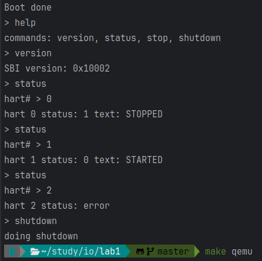
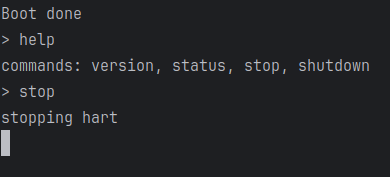

# Лабораторная работа #1 
## "Принципы организации ввода/вывода без операционной системы" по предмету "Системы ввода-вывода"
### Выполнил студент группы 1.1 Бардин Петр Алексеевич

# Введение

## Цель

Познакомится с принципами организации ввода/выводе без операционной системы на примере компьютерной системы на базе процессора с архитектурой RISC-V и интерфейсом OpenSBI с использованием эмулятора QEMU.

## Задание (вариант 2)
1. Реализовать функцию putchar вывода данных в консоль
2. Реализовать функцию getchar для получения данных из консоли
3. На базе реализованных функций putchar и getchar написать программу,
   позволяющую вызывать определенным вариантом функции OpenSBI
   посредством взаимодействия пользователя через меню
4. Запустить программу и выполнить вызов пунктов меню, получив результаты их
   работы

### Пункты меню:
1. Get SBI implementation version
2. Hart get status (должно быть возможно задавать номер ядра)
3. Hart stop
4. System Shutdow

# Выполнение

Разработанное решение размещено в системе контроля версий Git на хостинге Github: https://github.com/BardinPetr/itmo-io-lab-1

## Взаимодействие с OpenSBI

```c
void putchar(const char ch) {
    sbi_call(ch, 0, 0, 0, 0, 0, 0, 1);
}

static int32_t getch() {
    return sbi_call(0, 0, 0, 0, 0, 0, 0, 2).error;
}

char getchar() {
    int32_t ch;
    while ((ch = getch()) < 0);
    return ch;
}

uint32_t sbi_get_impl_version() {
    return sbi_call(0, 0, 0, 0, 0, 0, 2, 0x10).value;
}

uint32_t sbi_hart_get_status(uint32_t hartid) {
    sbiret_t ret = sbi_call(hartid, 0, 0, 0, 0, 0, 2, 0x48534D);
    if (ret.error != 0) return -1;
    return ret.value;
}

void sbi_hart_stop() {
    sbi_call(0, 0, 0, 0, 0, 0, 1, 0x48534D);
}

void sbi_shutdown() {
    sbi_call(0, 0, 0, 0, 0, 0, 0, 0x08);
}
```

# Демонстрация




# Вывод

В ходе работы успешно удалось запустить эмулятор QEMU, запустить в нем OpenSBI, настроить сборку минимального ядра, организовать взаимодействие 
с API OpenSBI и реализовать минимальный набор функций для работы с консольным вводом-выводом и обработки строк. 
На основе этого была написана демонстрационная программа с консольным shell-подобным интерфейсом для запроса информации из OpenSBI по командам.